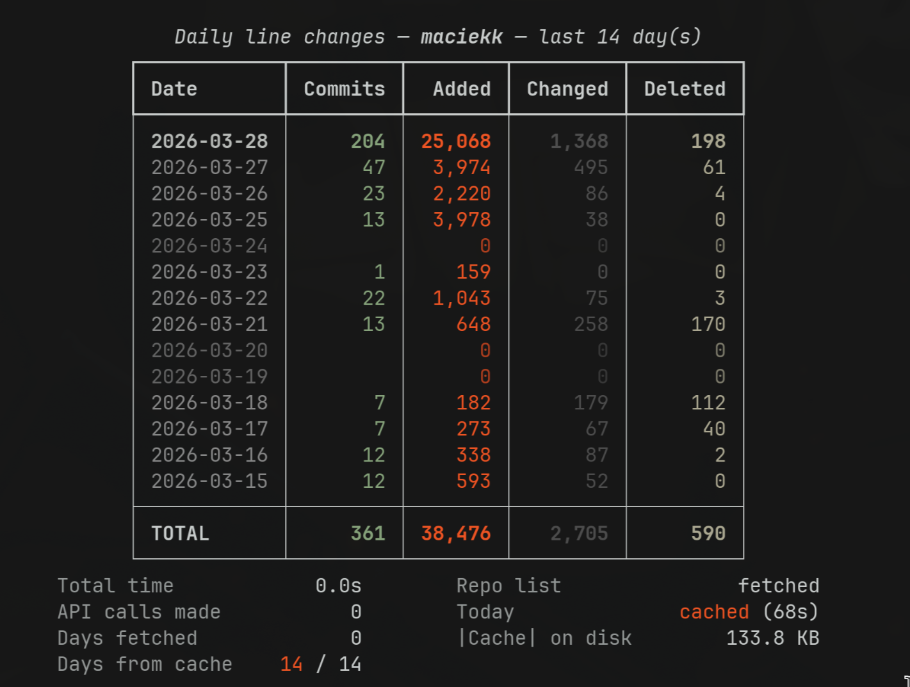

# loc-deltas

Shows daily line-change stats across all your GitHub repos in a terminal table.



**Column definitions:**

- **Added** — truly new lines (no corresponding deletion in the same file)
- **Changed** — lines modified in place (`min(additions, deletions)` per file)
- **Deleted** — truly removed lines (no corresponding addition in the same file)

## Requirements

- [uv](https://docs.astral.sh/uv/getting-started/installation/) — handles Python and dependencies automatically
- A GitHub personal access token (see below)

## Running

```bash
# last 7 days (default)
GITHUB_TOKEN=ghp_... uv run loc_deltas.py

# last 30 days
GITHUB_TOKEN=ghp_... uv run loc_deltas.py 30

# different user
GITHUB_TOKEN=ghp_... uv run loc_deltas.py 14 --user octocat
```

`uv` will automatically create a temporary virtual environment and install
`requests` and `rich` on the first run. No setup step needed.

## GitHub token

A token is not strictly required, but without one GitHub limits you to
**60 API requests per hour**. Because each commit requires a detail call,
that budget is easily exhausted. With a token the limit is **5 000 req/hour**.

### Getting a token

1. Go to **GitHub → Settings → Developer settings → Personal access tokens → Fine-grained tokens**
   (`https://github.com/settings/tokens?type=beta`)
2. Click **Generate new token**.
3. Set an expiry (90 days is a reasonable default).
4. Under **Repository access** choose **All repositories** (read-only is enough).
5. Under **Permissions → Repository permissions** grant **Contents: Read-only**.
   No other permissions are needed.
6. Click **Generate token** and copy the value — you won't see it again.

### Storing the token

Pick whichever option fits your workflow:

**Shell config (simplest)** — add to `~/.zshrc` or `~/.bashrc`:

```bash
export GITHUB_TOKEN=ghp_yourtoken
```

Then reload: `source ~/.zshrc`

**A `.env` file** — keep the token out of shell history and config:

```bash
echo "GITHUB_TOKEN=ghp_yourtoken" >> ~/.env
```

Load it when needed: `source ~/.env` — or add `source ~/.env` to your shell config.

**`pass` (encrypted, recommended for long-term storage):**

```bash
pass insert github/token          # prompts for the value
export GITHUB_TOKEN=$(pass github/token)
```

Add the export line to your shell config to load it automatically.

**macOS Keychain** (if you ever use this on a Mac):

```bash
security add-generic-password -a "$USER" -s github-token -w ghp_yourtoken
export GITHUB_TOKEN=$(security find-generic-password -a "$USER" -s github-token -w)
```

> **Never commit a token to git.** If you accidentally do, revoke it immediately
> on GitHub and generate a new one.
